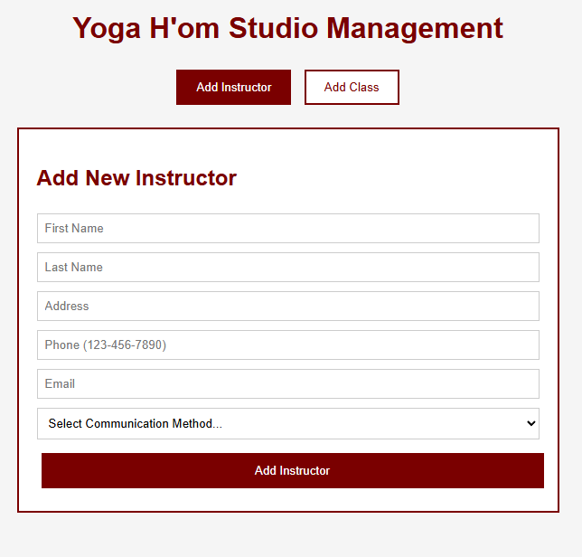

# YogaStudio
MERN-based full stack application for Yoga H'om studio.

The app can be opened <a href="https://yogastudio-6552649465ad.herokuapp.com/">here.</a> 

## Packages 
npm install express mongoose cors dotenv

## Part 1:
Focusing on two use cases:
- Manager adding instructors
    - starting with the schema for the db
- Manager adding classes.
    - starting with the schema for the db

Part 1 front end:

